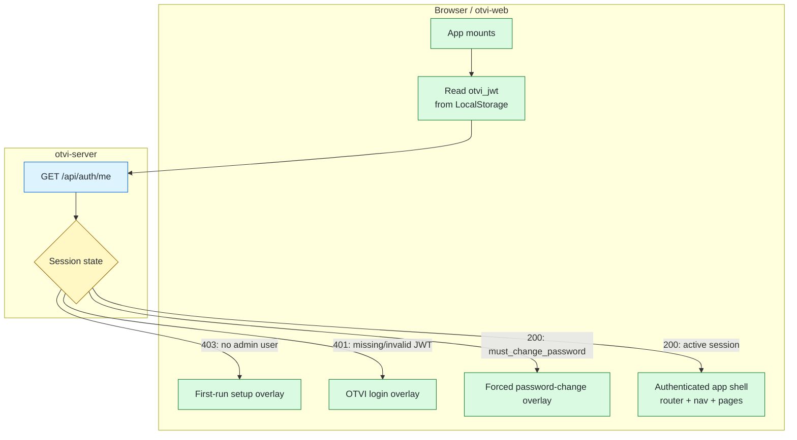
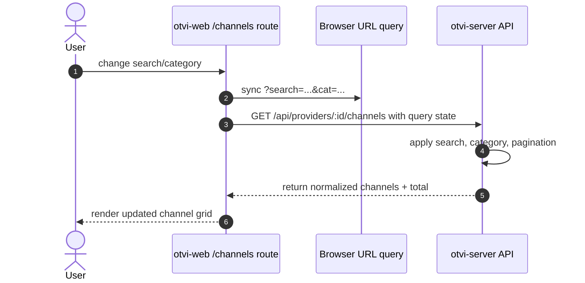

# Frontend Guide

OTVI's frontend is a Leptos CSR application compiled to WebAssembly with Trunk. The server serves the built assets and the browser talks to the Axum API for all auth, provider, channel, and playback operations.

## Build Process

```bash
cd web
trunk build
trunk serve
```

- Output directory: `../dist`
- Watched paths: `src/`, `index.html`, `input.css`
- Pre-build hook: Tailwind CSS v4 compiles `input.css` into `style.css`

## Route Model

The app mixes real routes with full-screen overlays:

### Real routes

- `/` — provider list
- `/admin` — admin dashboard
- `/login/:provider_id` — provider authentication flow
- `/providers/:provider_id/channels` — channel browser
- `/providers/:provider_id/play/:channel_id` — player
- `*` — not-found page

### Overlay-only experiences

- `setup.rs` — shown when no users exist yet
- `app_login.rs` — shown when the browser has no valid OTVI JWT
- `change_password.rs` — shown as a forced or voluntary password-change overlay

These are not standalone routes today; they are mounted by `web/src/app.rs` based on boot state.

## Boot Flow



- JWTs are stored in `LocalStorage` under `otvi_jwt`
- `AuthCtx` exposes the current user and admin status to child components
- Internal navigation uses router-aware links so route changes stay in SPA mode

## Channels Page

`/providers/:provider_id/channels` is query-driven:

- `?cat=<id>` controls the selected category filter
- `?search=<term>` controls the server-side search term
- both values are bookmarkable and restored through browser history

The frontend sends the
current query state to `GET /api/providers/:id/channels` and renders the
backend response directly. It does not run a second client-side search pass
over the returned list.



## Player Page

`/providers/:provider_id/play/:channel_id` fetches `StreamInfo` from the backend and uses the returned payload for:

- stream URL
- stream type (`hls` or `dash`)
- optional DRM config
- optional channel metadata (`channel_name`, `channel_logo`)

The player no longer fetches the full channel list just to resolve one title/logo.

Playback is bridged through `index.html`:

- `otviInitHls(videoId, url)` for HLS.js
- `otviInitDash(videoId, url, drmConfigJson)` for Shaka Player
- `otviDestroyPlayer()` during page cleanup

## Page Summary

| File | Runtime role |
| --- | --- |
| `web/src/app.rs` | app shell, boot state, overlays, router |
| `web/src/pages/home.rs` | provider listing |
| `web/src/pages/app_login.rs` | OTVI user login / registration overlay |
| `web/src/pages/setup.rs` | first-run admin setup overlay |
| `web/src/pages/change_password.rs` | forced + voluntary password-change overlay |
| `web/src/pages/login.rs` | provider auth flow page |
| `web/src/pages/channels.rs` | channel browser with URL-driven search/category state |
| `web/src/pages/player.rs` | video player with backend-supplied channel metadata |
| `web/src/pages/admin.rs` | admin dashboard |
| `web/src/pages/not_found.rs` | 404 page |

## Development Notes

- Run `trunk serve --proxy-backend=http://localhost:3000/api` for local frontend work
- The backend must be running separately for API calls to succeed
- Styling lives in `web/input.css`; generated CSS is written to `web/style.css`

## Frontend UI Testing

The frontend has browser-driven UI tests implemented with `wasm-bindgen-test` and deterministic API mocks in `web/src/api.rs` (enabled under the `ui-test` feature).

### Run locally

```bash
cd web
wasm-pack test --headless --firefox --features ui-test --lib
# or
bun run ui:test
```

The browser test runner reads `web/webdriver.json` when using the Chrome backend; CI currently uses Firefox for a more stable hosted-runner setup.

### Scope

- Boot-state overlays (`setup`, app login, forced password change)
- Authenticated shell and role-based nav behavior (admin dashboard link visibility, sign out)
- Primary route outcomes (`/`, `/admin`, `/login/:provider_id`, `*`)
- SPA route transitions and channel-to-player navigation context

### Troubleshooting

- Ensure Chrome/Chromium is installed and runnable in your environment.
- If running in locked-down CI/container environments, configure browser sandbox/capabilities explicitly via `webdriver.json` for `wasm-bindgen-test`.
