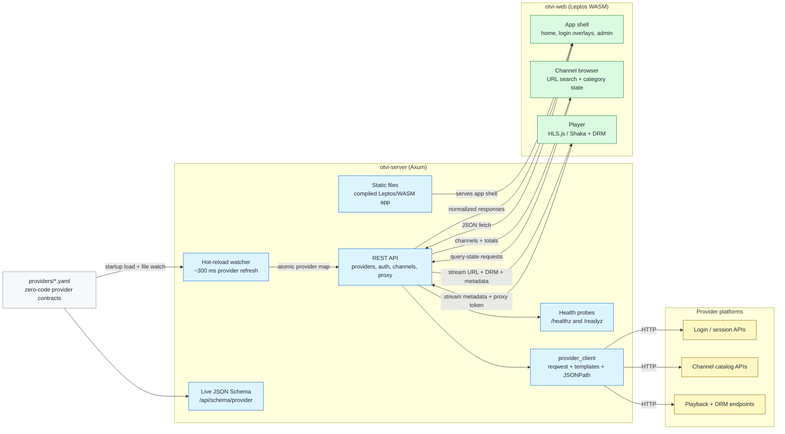

# OTVI – Open TV Interface

OTVI is a generic, **YAML-driven television interface** that lets any TV provider expose login, logout, channel browsing, and live playback (HLS / DASH + DRM) through simple configuration files. No custom code is needed per provider — just describe the API in a YAML file.

## Key Features

- **Zero-code provider integration** — define everything in YAML
- **Hot-reload** — edit a provider YAML and the server picks it up within ~300 ms, no restart needed
- **Multi-step authentication** — phone + OTP, email + password, SSO, and more
- **Template engine** — dynamic request building with `{{input.X}}`, `{{stored.X}}`, `{{uuid}}`, with warnings logged for any unresolved placeholders
- **Full JSONPath extraction** — pull values from API responses using filter expressions, recursive descent, and wildcards (powered by `jsonpath-rust`)
- **HLS & DASH streaming** — with full DRM support (Widevine, PlayReady)
- **Stream proxying** — transparent CDN authentication and CORS handling
- **Multi-user system** — JWT-based auth with admin/user roles
- **Password policy** — min 8 chars, uppercase, digit; enforced consistently across registration, change-password, and admin reset
- **`must_change_password` enforcement** — admin-created accounts are blocked from all API calls until the user sets a personal password
- **Per-user provider access control** — restrict which providers each user can access
- **Channel search & pagination** — server-side text search (`?search=`) and limit/offset pagination on channel lists
- **Database flexibility** — SQLite or PostgreSQL at runtime
- **Health & readiness probes** — `/healthz` (liveness) and `/readyz` (DB check) for orchestrators
- **Provider JSON Schema** — live `GET /api/schema/provider` endpoint for VS Code YAML auto-complete
- **Structured logging** — human-readable text by default; set `LOG_FORMAT=json` for Loki / Datadog
- **Configurable CORS** — permissive in dev, locked to specific origins in production via `CORS_ORIGINS`
- **Modern web UI** — responsive Leptos/WASM frontend with URL-driven channel search/filter state, skeleton loading states, and backend-supplied channel metadata in the player
- **Docker ready** — multi-stage build with built-in `HEALTHCHECK`, optimised release profile (LTO, symbol strip)

## How It Works

1. Provider YAML configs are loaded at server startup and **watched for changes** — any create, modify, or delete of a `.yaml`/`.yml` file is picked up automatically without restarting.
2. The Axum-based REST API proxies requests to external provider APIs based on the YAML definitions.
3. The Leptos WASM frontend communicates with the REST API to display providers, drive overlay-based OTVI auth, browse channels using URL query state, and play streams.

## Tech Stack

| Layer | Technology |
|-------|-----------|
| Backend | Rust + [Axum](https://github.com/tokio-rs/axum) |
| Frontend | Rust/WASM via [Leptos](https://leptos.dev/) + Tailwind CSS |
| Async Runtime | [Tokio](https://tokio.rs/) |
| HTTP Client | [Reqwest](https://docs.rs/reqwest) |
| Database | [SQLx](https://github.com/launchbadge/sqlx) (SQLite / PostgreSQL) |
| JSONPath | [jsonpath-rust](https://github.com/besok/jsonpath-rust) |
| JSON Schema | [schemars](https://graham.cool/schemars/) |
| File Watching | [notify](https://github.com/notify-rs/notify) |
| Build | Cargo + [Trunk](https://trunkrs.dev/) (WASM bundler) |
| Auth | JWT + Argon2id password hashing |
| Containerization | Docker (multi-stage build, built-in health check) |

## Project Structure

```mermaid
flowchart TD
    root["OTVI workspace"]

    subgraph ops["Runtime and release assets"]
        cargo["Cargo.toml\nworkspace + release profile"]
        docker["Dockerfile\nmulti-stage web → server → runtime"]
        compose["docker-compose*.yml\nproduction + hot-reload development"]
        providers["providers/*.yaml\nexample provider definitions"]
    end

    subgraph core["crates/otvi-core"]
        config["config.rs\nprovider schema + schemars JSON Schema"]
        template["template.rs\ntemplate variables + JSONPath extraction"]
        types["types.rs\nshared API request/response types"]
    end

    subgraph server["crates/otvi-server"]
        bootstrap["main.rs / lib.rs\nbootstrap, router, CORS, health, schema"]
        state["state.rs\nprovider map, DB pool, caches, proxy contexts"]
        watcher["watcher.rs\nprovider YAML hot-reload"]
        db["db.rs + migrations\nSQLx users, sessions, settings"]
        auth["auth_middleware.rs\nJWT claims + password-change guard"]
        client["provider_client.rs\nHTTP requests + template resolution"]
        api["api/*\nproviders, auth, channels, proxy, user_auth, admin"]
        tests["tests/integration.rs\nend-to-end server coverage"]
    end

    subgraph web["web/ Leptos WASM frontend"]
        trunk["Trunk.toml + index.html\nWASM entry + HLS.js/Shaka bridge"]
        styles["input.css / style.css\nTailwind styling"]
        app["src/app.rs\nrouting + auth state machine"]
        webapi["src/api.rs\ntyped backend client + token storage"]
        pages["src/pages/*\nhome, login, setup, channels, player, admin"]
    end

    root --> ops
    root --> core
    root --> server
    root --> web
    providers -- "loaded by" --> watcher
    config -- "schema contract" --> bootstrap
    template -- "render requests" --> client
    types -- "shared DTOs" --> api
    api --> state
    api --> db
    api --> auth
    api --> client
    bootstrap -- "serves static app" --> trunk
    app --> webapi
    webapi -- "JSON API" --> api
    pages --> app
    pages --> webapi

    classDef rootNode fill:#f6f8fa,stroke:#57606a,color:#24292f
    classDef opsNode fill:#fff8c5,stroke:#9a6700,color:#24292f
    classDef coreNode fill:#fbefff,stroke:#8250df,color:#24292f
    classDef serverNode fill:#ddf4ff,stroke:#0969da,color:#24292f
    classDef webNode fill:#dafbe1,stroke:#1a7f37,color:#24292f
    class root rootNode
    class cargo,docker,compose,providers opsNode
    class config,template,types coreNode
    class bootstrap,state,watcher,db,auth,client,api,tests serverNode
    class trunk,styles,app,webapi,pages webNode
```

## License

OTVI is licensed under **AGPL-3.0-only**. See [LICENSE](https://github.com/rabilrbl/otvi/blob/main/LICENSE) for details.
