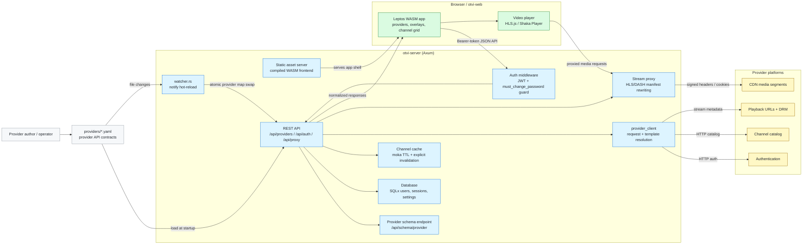
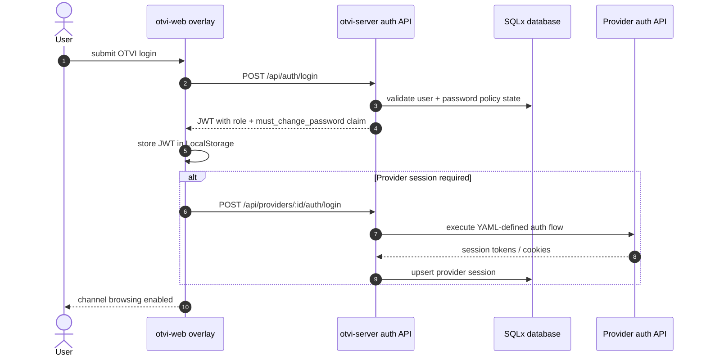
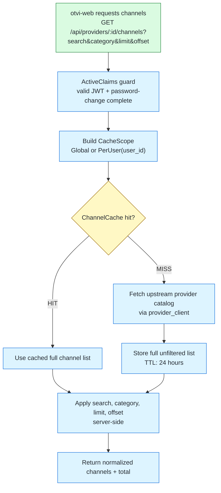
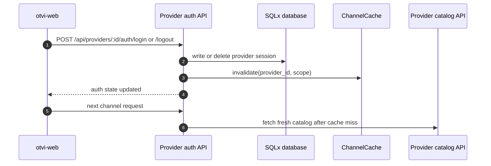
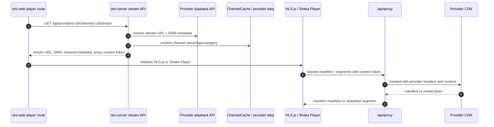
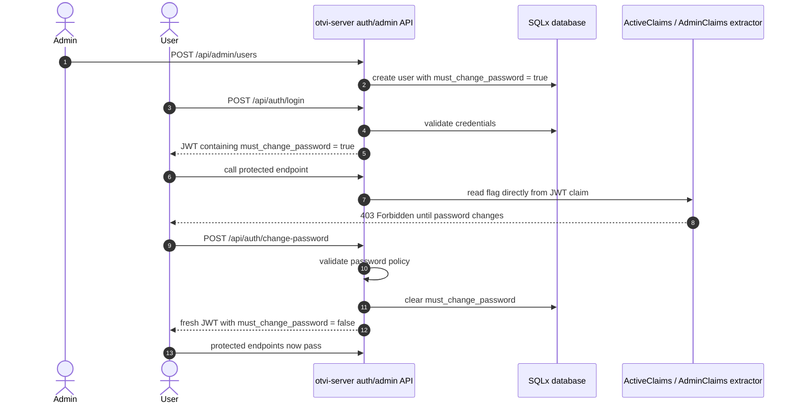

# Architecture

OTVI is built as a Rust workspace with three main crates, each handling a distinct layer of the application.

## System Overview

## Crate Overview

| Crate | Path | Purpose |
|-------|------|---------|
| **otvi-core** | `crates/otvi-core/` | Shared types: YAML config schema, API request/response types, template engine |
| **otvi-server** | `crates/otvi-server/` | Axum REST API, hot-reloads provider YAMLs, proxies API calls, serves frontend |
| **otvi-web** | `web/` | Leptos CSR frontend compiled to WASM via Trunk |

## otvi-core

The shared library that defines the contract between server and frontend.

### Key Modules

- **`config.rs`** — YAML schema types for provider configuration
  - `ProviderConfig`: top-level provider definition (derives `JsonSchema` for the live schema endpoint)
  - `AuthFlow`, `AuthStep`: authentication flow definitions
  - `RequestSpec`: generic HTTP request specification with template support
  - `ResponseMapping`: JSONPath-based response field extraction (derives `Default`)
  - `PlaybackEndpoint`: stream URL and DRM configuration
  - `ProxyConfig`: stream proxy settings

- **`types.rs`** — API request/response types shared between server and client
  - Provider info, auth flow info, field info
  - Login request/response, multi-step session handling
  - Channel and category data structures (including `total` for pagination)
  - Stream info with DRM details
  - User management types (roles, registration, sessions)

- **`template.rs`** — Template variable resolution engine
  - `TemplateContext`: key-value store for variable bindings
  - `ResolveResult { rendered, unresolved }`: returned by `resolve()` so callers know which placeholders were not substituted
  - `resolve_warn()`: calls `resolve()` and emits a `tracing::warn!` for every unresolved key
  - `resolve_lossy()`: silent fallback — unresolved placeholders are removed (legacy behaviour)
  - `extract_json_path()`: full JSONPath extraction powered by `jsonpath-rust` (filter expressions, recursive descent, wildcards); falls back to dot-notation walker for simple paths
  - Built-in variables: `{{uuid}}`, `{{utcnow}}`, `{{utcdate}}`

## otvi-server

The backend REST API built on [Axum](https://github.com/tokio-rs/axum).

### Key Modules

- **`main.rs`** — Application bootstrap
  - Reads `LOG_FORMAT` to switch between human-readable text and JSON structured logging
  - Initializes database pool (SQLite/PostgreSQL/MySQL) and runs migrations
  - Creates JWT signing keys from `JWT_SECRET`
  - Loads all provider YAML files from `PROVIDERS_DIR`
  - Spawns the background **hot-reload watcher** task
  - Sets up the Axum router with CORS, nested API routes, health probes, and schema endpoint
  - Serves compiled WASM frontend as static files

- **`watcher.rs`** — Hot-reload file-system watcher
  - Uses the [`notify`](https://github.com/notify-rs/notify) crate in a background Tokio task
  - Watches `PROVIDERS_DIR` for `.yaml`/`.yml` create, modify, and delete events
  - On any change, re-scans the directory and **atomically swaps** the provider map behind an `RwLock`
  - Changes are reflected within ~300 ms; no server restart is required

- **`state.rs`** — Application state management
  - `AppState`: holds an `RwLock<HashMap>` of providers, database pool, JWT keys, HTTP client, channel cache, and proxy context cache
  - `with_provider(id, f)` / `with_providers(f)`: safe accessor methods that acquire the read lock for the shortest possible time
  - `ProxyContext`: per-stream cache for headers and cookie mappings
  - `ChannelCache`: in-memory TTL cache for channel list and category responses, backed by [`moka`](https://github.com/moka-rs/moka)
    - Keyed by `(provider_id, CacheScope)` where `CacheScope` is either `Global` (one shared entry for all users) or `PerUser(user_id)` (isolated per user)
    - Default TTL: **24 hours** — overridable via `CHANNEL_CACHE_TTL_SECS`
    - Entries are invalidated explicitly on provider login / logout so a credential change is always reflected immediately, regardless of TTL
  - `load_providers()`: scans directory for `*.yaml`/`*.yml` files

- **`db.rs`** — Database abstraction layer
  - User CRUD operations (create, get, update, delete)
  - Provider session management (upsert, get, delete)
  - Per-user provider access control
  - Server settings storage
  - Supports SQLite, PostgreSQL, and MySQL through SQLx's `AnyPool`

- **`auth_middleware.rs`** — JWT authentication middleware
  - Token creation and validation — tokens have a **24-hour lifetime**
  - `Claims` extractor for authenticated routes
  - `ActiveClaims` extractor: requires a valid JWT **and** `must_change_password == false` — enforced from the JWT claim alone, no database query
  - `AdminClaims` extractor: requires a valid JWT, admin role, and `must_change_password == false`
  - `must_change_password` is embedded directly in the JWT at issuance time so every protected request can check the flag without a database round-trip; the token is re-issued whenever the flag changes (login, change-password, admin password-reset)

- **`provider_client.rs`** — HTTP client for provider APIs
  - Template variable resolution via `resolve_warn()` — logs a warning for every unresolved placeholder
  - Default header merging
  - JSON and form-encoded request body support

- **`error.rs`** — Centralized error handling
  - `AppError` enum with HTTP status code mapping
  - JSON error response formatting

### API Route Modules

| Module | Routes | Description |
|--------|--------|-------------|
| `api/providers.rs` | `GET /api/providers`, `GET /api/providers/:id` | Provider listing and details; enforces `must_change_password` guard |
| `api/auth.rs` | `POST /api/providers/:id/auth/login`, `POST .../logout`, `GET .../check` | Provider authentication |
| `api/channels.rs` | `GET /api/providers/:id/channels`, `.../categories`, `.../stream` | Channel browsing (server-side search + pagination), categories, stream info; full upstream response cached in `ChannelCache` |
| `api/proxy.rs` | `GET /api/proxy` | HLS/DASH stream proxying with M3U8 rewriting and CDN cookie injection |
| `api/user_auth.rs` | `POST /api/auth/register`, `.../login`, `.../change-password`, `GET .../me`, `POST .../logout` | OTVI user auth + shared password-policy validation + force-change guard |
| `api/admin.rs` | `/api/admin/users`, `/api/admin/settings` | User and system administration |

### Infrastructure Endpoints

Registered directly on the router (no `/api` prefix, no auth required):

| Endpoint | Description |
|----------|-------------|
| `GET /healthz` | Liveness probe — returns `200 OK` instantly |
| `GET /readyz` | Readiness probe — checks DB connectivity before responding |
| `GET /api/schema/provider` | Live JSON Schema for provider YAML files (generated via `schemars`) |

### CORS

`build_cors_layer()` reads the `CORS_ORIGINS` environment variable:

- **Unset or `"*"`** — permissive (all origins allowed); a production warning is emitted at startup.
- **Set to a comma-separated list** (e.g., `https://tv.example.com`) — restricts to those origins only.

### Release Profile

`Cargo.toml` sets `[profile.release]` with:
- `lto = "thin"` — link-time optimisation for a smaller binary
- `codegen-units = 1` — maximum single-codegen-unit optimisation
- `strip = "symbols"` — removes debug symbols from the final binary
- `panic = "abort"` — eliminates unwinding code

## otvi-web

The frontend is built with [Leptos](https://leptos.dev/) and compiled to WebAssembly using [Trunk](https://trunkrs.dev/).

### Key Components

- **`app.rs`** — Root component with routing and authentication context
  - Boot state machine: Loading → NeedsSetup / NeedsLogin / Ready
  - Route definitions for all pages
  - Navbar with navigation and auth controls
  - Forced password-change overlay (shown when `must_change_password` is `true`)

- **`api.rs`** — HTTP client for backend communication
  - Token storage in `LocalStorage`
  - Automatic Bearer token injection
  - Typed request/response handling

- **Pages** (`pages/` directory):

  | Page | File | Description |
  |------|------|-------------|
  | Home | `home.rs` | Provider listing |
  | Login | `login.rs` | Multi-step provider authentication route |
  | Setup | `setup.rs` | First-time admin setup overlay |
  | App Login | `app_login.rs` | OTVI user login / registration overlay |
  | Channels | `channels.rs` | Channel grid with **URL-driven search** (`?search=`), **URL-persisted category filter** (`?cat=<id>`), and **skeleton loading states** |
  | Player | `player.rs` | Video player with backend-supplied **channel name & logo** in the info card, plus a spinner skeleton while loading |
  | Admin | `admin.rs` | User management dashboard |
  | Change Password | `change_password.rs` | Forced + voluntary password change |
  | 404 | `not_found.rs` | Not-found page |

### Channel Search & Filter

- A **search box** with a clear button appears above the channel grid. The active search term is stored in the URL as `?search=<term>` and sent directly to the backend channels API.
- The **selected category** is stored in the URL as `?cat=<id>`, making filtered views bookmarkable and browser-history-aware.
- While channels are loading an **18-card skeleton grid** is displayed; the player shows a **spinning loader overlay**.

### Video Playback

The frontend uses a JavaScript bridge in `index.html` for video playback:

- **HLS.js** — for HLS streams (`.m3u8`)
- **Shaka Player** — for DASH streams with DRM support (Widevine, PlayReady)
- Bridge functions: `otviInitHls()`, `otviInitDash()`, `otviDestroyPlayer()`

## Data Flow

### Authentication Flow

### Channel List Flow

Cache entries are invalidated immediately when the provider session changes:

### Streaming Flow

### Hot-Reload Flow

```mermaid
flowchart LR
    fs["Provider YAML create / modify / delete\nin PROVIDERS_DIR"]
    notify["notify crate event\ninotify / kqueue / FSEvents"]
    task["watcher.rs\nbackground Tokio task"]
    scan["Re-scan *.yaml / *.yml"]
    validate["Parse ProviderConfig map"]
    swap["AppState.providers_rw.write()\natomic HashMap swap"]
    api["Subsequent API requests\nuse updated providers in ~300 ms"]

    fs --> notify --> task --> scan --> validate --> swap --> api

    classDef source fill:#f6f8fa,stroke:#8c959f,color:#24292f
    classDef server fill:#ddf4ff,stroke:#0969da,color:#24292f
    class fs source
    class notify,task,scan,validate,swap,api server
```

### `must_change_password` Enforcement Flow

